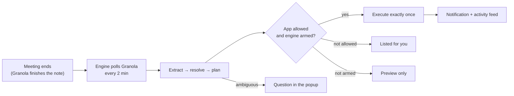
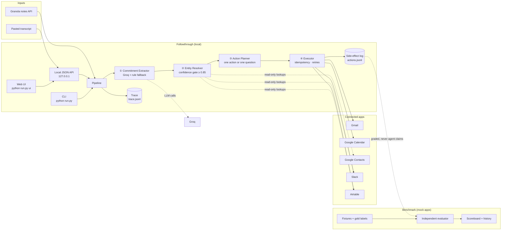
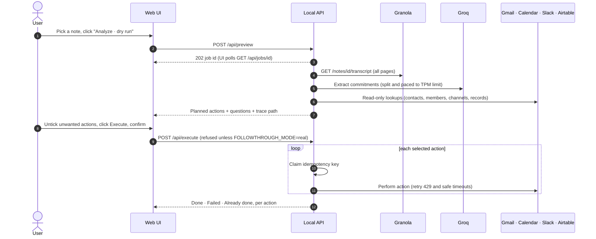
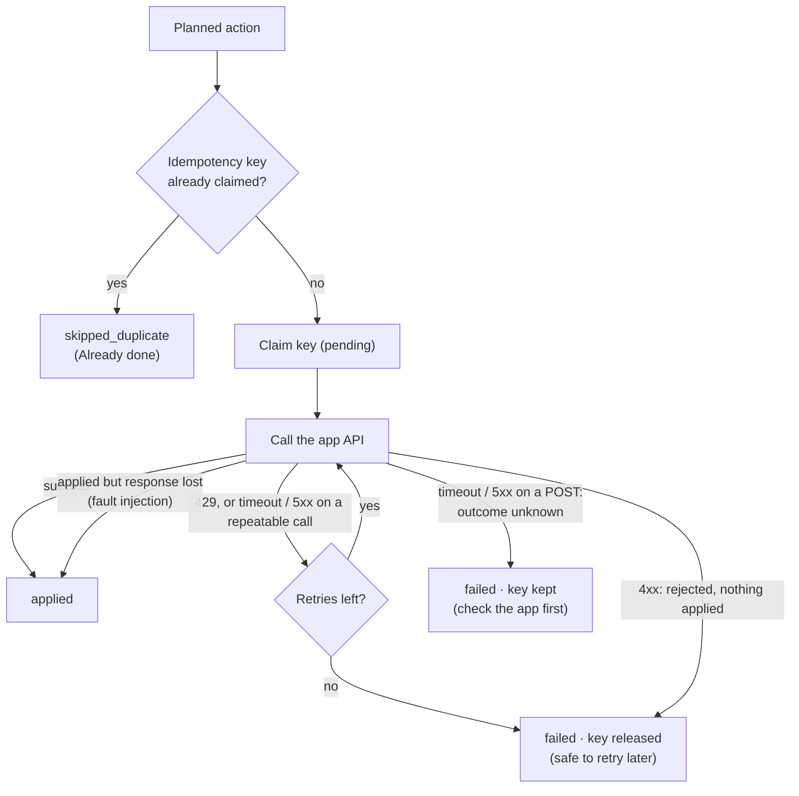

<div align="center">

# ◆ Followthrough

**Turn every meeting commitment into completed, verified work - across Gmail, Google Calendar, Slack and Airtable.**


[Overview](#overview) · [Live demo in 10 minutes](#live-demo-in-10-minutes) · [Architecture](#architecture) · [Reliability](#reliability-guarantees) · [Configuration](#configuration-reference) · [PRD](docs/PRD.md) · [Architecture deep dive](docs/ARCHITECTURE.md)

</div>

---

## Table of contents

1. [Overview](#overview)
2. [Key capabilities](#key-capabilities)
3. [Architecture](#architecture)
4. [How a live run works](#how-a-live-run-works)
5. [Reliability guarantees](#reliability-guarantees)
6. [Live demo in 10 minutes](#live-demo-in-10-minutes)
7. [Connecting your accounts](#connecting-your-accounts)
8. [Using Followthrough](#using-followthrough)
9. [Benchmark and evaluation](#benchmark-and-evaluation)
10. [Web API reference](#web-api-reference)
11. [Configuration reference](#configuration-reference)
12. [Security and privacy](#security-and-privacy)
13. [Observability](#observability)
14. [Project structure](#project-structure)
15. [Troubleshooting](#troubleshooting)
16. [Roadmap](#roadmap)
17. [Documentation](#documentation)

---

## Overview

Customer-facing teams make dozens of promises on calls - *"I'll send the proposal"*, *"let's meet Friday at 10"*, *"I'll move the deal to Negotiation"*. Many are forgotten, done late, or done for the wrong person.

**Followthrough** is a multi-step AI agent that reads a [Granola](https://granola.ai) meeting transcript and:

1. **Extracts** every explicit commitment (and ignores hedged talk like *"maybe we could…"*).
2. **Resolves** each person, channel and record against your real apps, with a confidence gate.
3. **Plans** exactly one structured action per commitment - or asks a clarifying question instead of guessing.
4. **Executes** approved actions exactly once, with retries, idempotency keys and a full audit trail.
5. **Grades itself** against seeded fixtures with gold labels the agent never sees.

It ships as a **browser extension** (the main product: sign up, allow apps, and it runs on autopilot after every meeting), a **local engine** with a futuristic web dashboard, and a **CLI** - all driving the same pipeline.

> Built for the **Multi-App AI Agent Hackathon** (≥ 3 external apps, provable reliability).

## The extension - autopilot after every meeting



1. `python run.py engine` (or `.\engine\install-windows.ps1` to start with Windows).
2. Load the `extension` folder in Chrome/Edge (**Developer mode → Load unpacked**), or the zip from `python run.py package-extension`.
3. In the popup: enter your email → tick the apps it may use → **Start autopilot**.

From then on, a few minutes after each meeting you own ends, the allowed actions are completed and you get a notification. Anything ambiguous is asked, never guessed; unticked apps are skipped and shown. Full details: [`extension/README.md`](extension/README.md).

## Key capabilities

| Capability | Details |
|---|---|
| 🎙️ **Transcript ingestion** | Granola public API (paginated transcripts) or pasted text |
| 🧠 **LLM extraction** | Groq `openai/gpt-oss-120b`, long transcripts split and paced to the tokens-per-minute limit, automatic rule-based fallback with visible warnings |
| 🎯 **Entity resolution** | Google Contacts, Slack members and channels, Airtable records - ambiguous or low-confidence matches become questions |
| ⚡ **Four action types** | Gmail send · Calendar event · Slack post · Airtable record update |
| 🛡️ **Human in the loop** | Dry-run preview, per-action selection, explicit confirmation, real mode locked behind `.env` |
| 🔁 **Exactly-once execution** | File-backed idempotency keys claimed *before* each call; safe re-runs and restarts |
| 📊 **Independent evaluation** | 5 gold-labelled fixtures, fault injection (timeouts, 429s, lost responses), weighted scoring with hard-fail invariants |
| 🔍 **Observability** | One replayable JSONL trace per run plus a side-effect log |
| 🪶 **Zero-dependency core** | Pipeline, integrations and web server use only the Python standard library |

---

## Architecture



| Stage | Module | Responsibility |
|---|---|---|
| ① Extract | [`agents/commitment_extractor.py`](followthrough/agents/commitment_extractor.py) | Groq extraction with chunking, pacing, retry on truncation or rate limit; deterministic fallback |
| ② Resolve | [`agents/entity_resolver.py`](followthrough/agents/entity_resolver.py) | Search connected apps; score candidates; mark ambiguous or low-confidence as clarification |
| ③ Plan | [`agents/action_planner.py`](followthrough/agents/action_planner.py) | One validated action per commitment, or a clarification request |
| ④ Execute | [`agents/executor.py`](followthrough/agents/executor.py) | Idempotency check, optimistic key claim, retries, record every effect |
| Integrations | [`integrations/`](followthrough/integrations) | Real Granola, Gmail, Calendar, Contacts, Slack, Airtable adapters (same interface as mocks) |
| Web | [`web/server.py`](followthrough/web/server.py) · [`web/static/`](followthrough/web/static) | Background jobs, JSON API, single-page app |

A deeper design walkthrough lives in [`docs/ARCHITECTURE.md`](docs/ARCHITECTURE.md).

---

## How a live run works



---

## Reliability guarantees

Every fixture run is graded on the **side-effect log** - what actually happened - never on the agent's own claims.

| # | Invariant | How it is enforced |
|---|---|---|
| **I1** | Exactly one action per commitment | Evaluator counts applied effects per commitment |
| **I2** | No action without a confidently resolved entity | Resolver confidence gate (0.85, near-ties rejected) + wrong-entity hard fail |
| **I3** | Zero duplicate side effects on re-run or restart | File-backed idempotency keys claimed before the call; mock app ledgers double-checked |
| **I4** | Clarify, don't guess | Ambiguous resolution becomes a question and is never executed |
| **I5** | Zero hallucinated actions | Every applied effect must map to a gold commitment |

### Exactly-once execution



Live idempotency keys are derived from **what the action does** (app, action, target) rather than LLM-generated ids, so re-running the same call never repeats an email, event, post or edit.

---

## Live demo in 10 minutes

### Prerequisites

| Requirement | Notes |
|---|---|
| Python **3.10+** | Developed and tested on Python 3.11 (Windows) |
| Groq API key | Free tier works (8,000 tokens/minute) |
| Granola **Business or Enterprise** plan | Required for API keys |
| Google account (test account recommended) | Gmail, Calendar, Contacts |
| Slack workspace (sandbox recommended) | Bot app with 4 scopes |
| Airtable base | Table `Deals` with `Name` and `Stage` fields |

> ⚠️ **Use sandbox accounts.** Real mode sends real emails, creates real events, posts to Slack and edits Airtable.

### Step 1 - Install

```bash
git clone <your-repo-url> followthrough
cd followthrough
pip install groq google-auth-oauthlib
```

The core needs no packages. `groq` powers LLM extraction; `google-auth-oauthlib` is only used once, by `get_google_token.py`.

### Step 2 - Configure

```bash
cp .env.example .env        # Windows: copy .env.example .env
```

Fill in the keys (see [Connecting your accounts](#connecting-your-accounts)). Keep `FOLLOWTHROUGH_MODE=mock` for now.

### Step 3 - Authorise Google (one time)

Download your OAuth **Desktop app** client as `credentials.json` into the project folder, then:

```bash
python get_google_token.py
```

A browser opens; sign in with your test account. `token.json` is saved and renewed automatically afterwards.

### Step 4 - Verify every connection

```bash
python run.py check
```

```text
✅ Groq      model openai/gpt-oss-120b answered
✅ Granola   5 recent note(s) visible
✅ Slack     bot 'followthrough' in workspace 'Andromeda Sandbox', will post to #updates
✅ Airtable  base appXXXXXXXXXXXXXX, table 'Deals' reachable (1 record read)
✅ Google    token valid; Calendar and Contacts reachable
```

### Step 5 - Launch the app

```bash
python run.py ui            # opens http://127.0.0.1:8765
```

### Step 6 - Preview a call (safe)

1. **Live run** tab → choose a **Granola** note, or **Paste** → **Load the demo call**.
2. Click **◆ Analyze · dry run** and watch the live log.
3. Review the planned action cards and the *Needs your input* questions. Nothing has been sent.

### Step 7 - Execute for real

1. Set `FOLLOWTHROUGH_MODE=real` in `.env` and restart `python run.py ui` - the header shows **REAL MODE · ARMED**.
2. Analyze the call again, untick anything you don't want, click **Execute**, then **Send for real**.
3. Each card turns **Done**, **Failed** (with the reason) or **Already done**.
4. Set `FOLLOWTHROUGH_MODE=mock` again when you finish.

### Demo call script

Record this in Granola (two people) or use **Load the demo call**:

```text
Alex: Hi Sam, thanks for joining. This is a quick sync on the Acme renewal.
Sam:  Sure. I spoke with Daniel Cho yesterday. They're happy with the product and want pricing for next year.
Alex: Good. I'll send the pricing proposal to Daniel Cho.
Sam:  Great. They also asked for a pricing review meeting.
Alex: Let's put Friday at 10am on the calendar for the pricing review.
Sam:  Works for me. The deal has moved forward, so the pipeline is out of date.
Sam:  I'll update the deal stage to Negotiation for the Acme record in Airtable.
Alex: Perfect. The rest of the team should know about this too.
Alex: Please post the renewal status in the Slack updates channel.
Sam:  Will do. Maybe we could also share the case study with Priya next month, but there's no rush for now.
Alex: Agreed, not today. Just to confirm, I'll send the pricing proposal to Daniel Cho.
Sam:  Sounds good. Thanks, talk soon.
```

| Line | Expected outcome |
|---|---|
| Send the pricing proposal to Daniel Cho | 📧 One email (requires *Daniel Cho* in Google Contacts), duplicate mention skipped |
| Friday at 10am on the calendar | 📅 30-minute event next Friday, 10:00 local time |
| Deal stage to Negotiation for the Acme record | 🗂️ Airtable `Acme` → `Negotiation` |
| Post the renewal status in the Slack updates channel | 💬 Message in `#updates` |
| "Maybe we could also share the case study…" | Ignored (hedged) |

---

## Connecting your accounts

<details>
<summary><b>Groq</b> - LLM extraction</summary>

1. Create a key at [console.groq.com/keys](https://console.groq.com/keys).
2. Set `GROQ_API_KEY`. Defaults: `GROQ_MODEL=openai/gpt-oss-120b`, `GROQ_REASONING_EFFORT=medium`, `GROQ_TEMPERATURE=0.2`.
3. On the free tier keep `GROQ_TPM_LIMIT=8000`; long transcripts are split and paced automatically.
</details>

<details>
<summary><b>Granola</b> - transcripts</summary>

1. Granola → **Settings → Connectors → API keys** (Business or Enterprise plan).
2. Access: **Personal notes** only. Choose an expiry for hackathon use.
3. Set `GRANOLA_API_KEY`. Only notes with a finished AI summary and transcript are returned.
</details>

<details>
<summary><b>Google</b> - Gmail, Calendar, Contacts</summary>

1. [Google Cloud Console](https://console.cloud.google.com) → new project → enable **Gmail API**, **Google Calendar API**, **People API**.
2. OAuth consent screen: **External**, **Testing**, add your test account as a test user.
3. Scopes: `gmail.send`, `calendar.events`, `contacts.readonly`.
4. Credentials → **OAuth client ID → Desktop app** → download as `credentials.json`.
5. Run `python get_google_token.py`. In Testing mode the sign-in lasts 7 days; run it again when it expires.
6. Add the people you mention on calls to **Google Contacts**.
</details>

<details>
<summary><b>Slack</b> - posts and mentions</summary>

1. [api.slack.com/apps](https://api.slack.com/apps) → **Create New App → From a manifest**:

   ```yaml
   display_information:
     name: Followthrough
   features:
     bot_user:
       display_name: Followthrough
       always_online: false
   oauth_config:
     scopes:
       bot: [chat:write, chat:write.public, users:read, channels:read]
   settings:
     org_deploy_enabled: false
     socket_mode_enabled: false
     token_rotation_enabled: false
   ```
2. **Install to Workspace**, copy the **Bot User OAuth Token** (`xoxb-…`) into `SLACK_BOT_TOKEN`.
3. Create a public `#updates` channel (otherwise the workspace's default channel is used).
4. People mentioned with *"loop in &lt;name&gt;"* must be members whose full name matches.
</details>

<details>
<summary><b>Airtable</b> - deal records</summary>

1. Create a base with a table **`Deals`**: primary field **`Name`**, single select **`Stage`** with one-word options (`Discovery`, `Qualification`, `Proposal`, `Negotiation`, `Won`, `Lost`).
2. [airtable.com/create/tokens](https://airtable.com/create/tokens): scopes `data.records:read`, `data.records:write`, access to that base only.
3. Set `AIRTABLE_API_KEY`, `AIRTABLE_BASE_ID` (the `app…` part of the base URL) and `AIRTABLE_TABLE_NAME`.
</details>

---

## Using Followthrough

### Web UI

| Tab | What you can do |
|---|---|
| **Live run** | Pick a Granola note or paste a transcript → dry-run preview → select actions → execute (real mode) |
| **Benchmark** | Run the fixture suite with or without Groq and fault injection; scoreboard and history |
| **System** | Read-only connection checks; current safety mode |

### CLI reference

| Command | Purpose |
|---|---|
| `python run.py engine [port]` | Start the engine for the extension: autopilot + dashboard, no browser opened |
| `python run.py package-extension` | Zip the extension into `dist/followthrough-extension.zip` |
| `python run.py ui [port] [--no-browser]` | Start the web dashboard only (default port 8765) |
| `python run.py check` | Test all five connections (read-only) |
| `python run.py notes [count]` | List recent Granola notes and their ids |
| `python run.py live <note_id> --dry-run` | Plan actions for a note; send nothing |
| `python run.py live <note_id>` | Plan and execute (requires `FOLLOWTHROUGH_MODE=real`) |
| `python run.py suite` | Benchmark with the Groq extractor |
| `python run.py suite --no-llm` | Benchmark with the deterministic rule-based extractor |
| `python run.py suite --faults` | Benchmark with injected timeouts, 429s and lost responses |
| `python run.py fixture <fixture_id>` | Run and score a single fixture |
| `python run.py replay fixture_005` | Restart-after-partial-execution proof (0 new side effects) |
| `python run.py history` | Score history per agent version |
| `python tests/test_invariants.py` | 6 invariant tests (set `PYTHONPATH=.`) |

---

## Benchmark and evaluation

| Fixture | Category | What it proves |
|---|---|---|
| `fixture_001` | Basic multi-app | Gmail + Calendar + Slack end to end |
| `fixture_002` | Four apps | Adds an Airtable record update |
| `fixture_003` | Ambiguous entity | "Priya" (Sharma vs Priyanka Rao) → clarifies, zero side effects |
| `fixture_004` | Negatives + duplicates | Hedged statements ignored; repeated ask → one email |
| `fixture_005` | Fault injection | Timeout, 429, applied-but-lost → exactly once |

**Scoring** ([`evaluation/scorer.py`](followthrough/evaluation/scorer.py)):

| Component | Weight |
|---|---|
| Commitment extraction F1 | 25% |
| Entity accuracy | 20% |
| Action planning accuracy (incl. correct clarifications) | 20% |
| Execution correctness (graded from the side-effect log) | 20% |
| Side-effect safety (no duplicates, wrong entities or hallucinated actions) | 15% |

A fixture **passes** only with **no hard failures** and extraction F1, entity accuracy and action accuracy all ≥ 0.99. Gold labels live in `fixtures/*/gold.json` and are structurally excluded from the agent's view (`Fixture.agent_view()`).

Current results (agent `v1.0`): **5/5 PASS** with the rule-based extractor (clean and fault-injected) and with the Groq extractor (clean); **6/6** invariant tests.

---

## Web API reference

All endpoints are served on `127.0.0.1` only. `POST` bodies must be JSON.

| Method | Endpoint | Description |
|---|---|---|
| `GET` | `/api/status` | Mode, armed state, onboarding, autopilot status, active job |
| `GET` / `POST` | `/api/settings` | Read / merge user settings (profile, allowed apps, autopilot) |
| `GET` | `/api/autopilot` | Autopilot status (engine mode only) |
| `POST` | `/api/autopilot/run-now` | Poll Granola immediately |
| `GET` | `/api/activity?limit=&since=` | Autopilot activity feed, newest first |
| `GET` | `/api/check` | Connection checks (read-only) |
| `GET` | `/api/notes` | Up to 30 recent Granola notes |
| `GET` | `/api/history` | Last 20 benchmark runs |
| `GET` | `/api/jobs/{id}` | Job status, live log and result |
| `POST` | `/api/preview` | `{"note_id": "…"}` or `{"transcript": "…", "title": "…"}` → dry-run job |
| `POST` | `/api/execute` | `{"preview_job_id": "…", "action_ids": ["…"]}` → execution job (real mode only) |
| `POST` | `/api/suite` | `{"llm": bool, "faults": bool}` → benchmark job |

Long operations return `202` with a job; one job runs at a time (`409` while busy). Cross-origin calls are accepted only from browser extensions (`chrome-extension://`, `moz-extension://`).

---

## Configuration reference

All settings are read from environment variables or `.env` (real environment variables take precedence).

| Variable | Default | Description |
|---|---|---|
| `FOLLOWTHROUGH_MODE` | `mock` | `real` arms the engine from `.env` (the extension's **Act for real** switch does the same without editing files) |
| `GROQ_API_KEY` | - | Enables LLM extraction |
| `GROQ_MODEL` | `openai/gpt-oss-120b` | Groq model id |
| `GROQ_REASONING_EFFORT` | `medium` | `low` \| `medium` \| `high` |
| `GROQ_TEMPERATURE` | `0.2` | Lower = more consistent extraction |
| `GROQ_TPM_LIMIT` | `8000` | Tokens per minute for your Groq tier |
| `GROQ_CHUNK_CHARS` | `16000` | Maximum transcript part size |
| `GRANOLA_API_KEY` | - | Granola API key |
| `GRANOLA_API_URL` | `https://public-api.granola.ai/v1` | Granola base URL |
| `GOOGLE_CREDENTIALS_JSON` | `credentials.json` | OAuth desktop client (relative to project root) |
| `GOOGLE_TOKEN_JSON` | `token.json` | Stored, auto-renewed token |
| `GMAIL_API_URL` | `https://gmail.googleapis.com/gmail/v1` | Gmail base URL |
| `GCAL_API_URL` | `https://www.googleapis.com/calendar/v3` | Calendar base URL |
| `FT_EVENT_MINUTES` | `30` | Calendar event length |
| `SLACK_BOT_TOKEN` | - | `xoxb-…` bot token |
| `SLACK_API_URL` | `https://slack.com/api` | Slack base URL |
| `AIRTABLE_API_KEY` | - | Personal access token |
| `AIRTABLE_BASE_ID` | - | `app…` |
| `AIRTABLE_TABLE_NAME` | `Deals` | Table name |
| `AIRTABLE_API_URL` | `https://api.airtable.com/v0` | Airtable base URL |
| `FT_MAX_RETRIES` | `3` | Attempts per action |
| `FT_RETRY_BACKOFF_S` | `0.05` | Backoff step between attempts |
| `FT_MIN_ENTITY_CONFIDENCE` | `0.85` | Below this, clarify instead of acting |
| `FT_AGENT_VERSION` | `v1.0` | Label recorded in traces and score history |

---

## Security and privacy

| Control | Implementation |
|---|---|
| **Local only** | Web server binds to `127.0.0.1`; data flows only to the APIs you configure |
| **DNS-rebinding and CSRF protection** | Requests must be addressed to `localhost`/`127.0.0.1`; `POST` requires `application/json` |
| **Armed only by you** | Real sends need the engine armed: the extension's **Act for real** switch (confirmed) or `FOLLOWTHROUGH_MODE=real`; manual runs also ask for confirmation in the UI |
| **Allowed apps** | Autopilot only executes in apps you ticked; everything else is listed, not sent |
| **Least privilege** | Minimal OAuth and bot scopes; Airtable token limited to one base |
| **Secrets hygiene** | `.env`, `credentials.json`, `token.json` and `runs/` are git-ignored; secrets never returned by the API |
| **No silent guessing** | Ambiguous or low-confidence entities become questions |
| **Safe failure** | Rejected writes release their key; writes with unknown outcome keep it and ask you to check |

> Transcripts are sent to Groq for extraction. Review your organisation's data policies before using real customer calls.

---

## Observability

Every run writes to `runs/<run_id>/`:

| File | Contents |
|---|---|
| `trace.jsonl` | Every step: ingest, extraction method and warnings, resolutions, plans, retries, errors, results |
| `actions.jsonl` | The side-effect log - the source of truth the evaluator grades |

Additional state: `runs/live_idempotency.jsonl` (live exactly-once keys) and `runs/score_history.jsonl` (benchmark history).

---

## Project structure

```text
followthrough/
├── run.py                        # CLI: engine · ui · check · notes · live · suite · replay · history
├── get_google_token.py           # one-time Google sign-in → token.json
├── .env.example                  # configuration template
├── extension/                    # Chrome/Edge extension (main product): manifest, popup, background worker
├── engine/install-windows.ps1    # start the engine at Windows sign-in
├── followthrough/
│   ├── config.py                 # settings + stdlib .env loader
│   ├── settings.py               # user settings: profile, allowed apps, autopilot, arming
│   ├── autopilot.py              # watches Granola, runs the pipeline per meeting, activity feed
│   ├── pipeline.py               # run_fixture · plan_live · execute_live · run_live
│   ├── health.py                 # connection checks
│   ├── agents/                   # extractor · resolver · planner · executor · Groq client
│   ├── integrations/             # Granola · Gmail · Calendar · Google auth · Slack · Airtable
│   ├── web/                      # server.py (JSON API + jobs) · static/ (HTML, CSS, JS)
│   ├── mocks/                    # deterministic mock apps + seeded world
│   ├── reliability/              # trace · idempotency · recorder · fault injection
│   ├── evaluation/               # evaluator · scorer · regression runner
│   └── fixtures_lib/             # fixture loader with gold-label isolation
├── fixtures/fixture_00X/         # transcript.txt · world.json · gold.json · faults.json
├── schemas/                      # gold · action · world JSON schemas
├── tests/test_invariants.py      # 6 invariant tests
└── docs/
    ├── PRD.md                    # product requirements
    ├── ARCHITECTURE.md           # design deep dive
    └── RELIABILITY_BRIEF.md      # hackathon reliability brief
```

---

## Troubleshooting

| Symptom | Cause | Fix |
|---|---|---|
| `⚠️ Groq failed on part …` | Rate limit or the model ran out of output tokens | Automatic retry already happened; set `GROQ_REASONING_EFFORT=low` or upgrade the Groq tier |
| `Request too large … tokens per minute` | Groq free-tier limit | Keep `GROQ_TPM_LIMIT=8000`; long calls take a few minutes |
| `Cannot determine target app` | Commitment mentions no email, Slack, calendar time or Airtable deal | Expected for internal tasks; phrase follow-ups explicitly |
| `Could not confidently resolve 'Name'` | Person not in Google Contacts or Slack | Add the contact, or use their full name as stored |
| `No time found for calendar event` | Time written as `10 a.m.` | Say or type `10am` |
| `Slack … missing_scope` / `not_in_channel` | Bot scopes or channel | Reinstall the app with the 4 scopes; use a public channel |
| `Google token renewal failed … invalid_grant` | Testing-mode sign-in expired (7 days) | `python get_google_token.py` |
| `The engine is not armed` | Safety lock | Turn on **Act for real** in the extension, or set `FOLLOWTHROUGH_MODE=real` |
| Popup says **Engine not running** | Engine stopped or on another port | `python run.py engine`, or set the engine address in the popup |
| Autopilot never picks up a meeting | Note not finished, or owned by another email | Wait for Granola's AI summary; check the email in Settings or untick **Only my meetings** |
| `Can't start on port 8765` | Port in use | `python run.py ui 8766` |

---

## Roadmap

| Horizon | Items |
|---|---|
| **Next** | Answer clarification questions in the UI and re-plan · LLM-drafted email bodies and event titles · Slack channel names in cards · Granola webhooks for automatic runs |
| **Later** | CRM integrations (HubSpot, Salesforce) · attachments from Drive · team deployment with authentication and audit export · per-user approval policies |

Full requirements, metrics and risks: [`docs/PRD.md`](docs/PRD.md).

## Documentation

| Document | Purpose |
|---|---|
| [`docs/PRD.md`](docs/PRD.md) | Product requirements: users, goals, requirements, metrics, roadmap |
| [`docs/ARCHITECTURE.md`](docs/ARCHITECTURE.md) | Components, data contracts, job lifecycle, reliability and security design |
| [`docs/RELIABILITY_BRIEF.md`](docs/RELIABILITY_BRIEF.md) | Hackathon reliability submission brief |

## License

No license has been chosen yet. Add a `LICENSE` file before publishing or accepting contributions.
