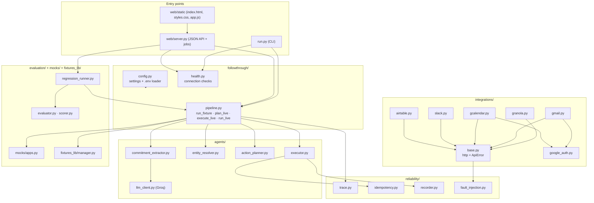
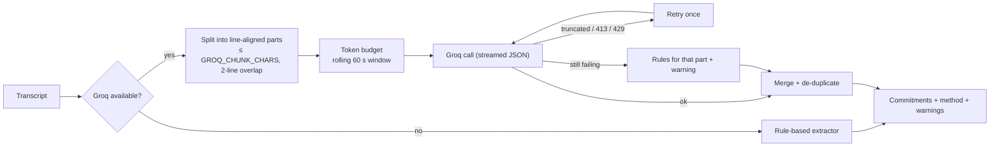
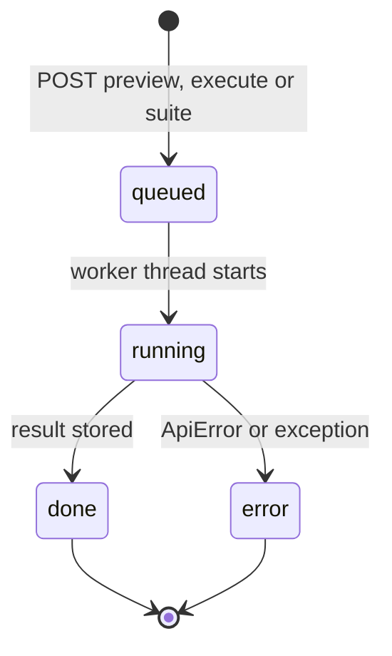

# Followthrough — Architecture

This document explains how Followthrough is built: its components, data contracts, execution model and the design decisions behind its reliability and safety guarantees. For setup and usage, see the [README](../README.md); for product scope, see the [PRD](PRD.md).

---

## 1. Design principles

| Principle | What it means in code |
|---|---|
| **Grade behaviour, not claims** | The evaluator reads the side-effect log (`actions.jsonl`) and the mock apps' own ledgers |
| **Clarify, don't guess** | Any unresolved, ambiguous or low-confidence entity becomes a clarification plan |
| **Claim before you act** | Idempotency keys are written *before* the integration call |
| **One interface, two worlds** | Mock and real integrations share `find_*()` + `execute(action, **params)` |
| **Human in the loop** | Planning and execution are separate steps; execution requires real mode and confirmation |
| **Standard library core** | Pipeline, integrations and web server need no third-party packages |

## 2. Module map



## 3. Execution paths

| Path | Entry | Apps | Idempotency store | Evaluated |
|---|---|---|---|---|
| **Benchmark** | `run.py suite`, `/api/suite` | Mock apps seeded from `world.json` | Per run (`runs/<run_id>/idempotency.jsonl`) | Yes, against `gold.json` |
| **Live preview** | `run.py live --dry-run`, `/api/preview` | Real apps, read-only lookups | Not used | No |
| **Live execution** | `run.py live`, `/api/execute` | Real apps | Shared (`runs/live_idempotency.jsonl`) | No |

## 4. Pipeline stages

### 4.1 Commitment extraction



- The prompt requires verbatim sentences, treats requests to others as commitments, excludes hedged statements and forbids splitting one sentence into several commitments.
- `extract_detailed()` returns `method` (`llm`, `mixed`, `heuristic`), part count and warnings; both are logged to the trace and shown in the UI.

### 4.2 Entity resolution

- Names are extracted from phrases such as *to / with / for / loop in / cc / mention*.
- Email commitments search Google Contacts (People API); Slack commitments search workspace members; deal references search Airtable by `Name`.
- Candidates are scored: exact match `1.0`, all query tokens contained `0.95`, first-name match `0.9`, partial first name `0.85`.
- A result resolves only if it is an exact match, or it scores ≥ `FT_MIN_ENTITY_CONFIDENCE` with no runner-up within 0.1. Otherwise the commitment needs clarification.

### 4.3 Action planning

| App | Trigger phrases | Parameters |
|---|---|---|
| Slack | "slack", "post … channel", "loop in" | `channel` (first matching `updates`, else the default channel), `message`, `mention` |
| Airtable | "airtable", "deal stage", "update … record" | `record_id`, `fields: {Stage}` |
| Calendar | "calendar", "schedule", a time like `10am` | `title`, `time` |
| Gmail | "email", "send" | `recipient`, `subject` |

Commitments with no target app, no resolved recipient or record, or no time produce a clarification plan instead of an action.

### 4.4 Execution

See the exactly-once diagram in the [README](../README.md#exactly-once-execution). Key rules:

- `store.record(key, "pending")` happens **before** the call.
- `TransientError` (429, or timeout / 5xx on repeatable methods) is retried up to `FT_MAX_RETRIES`.
- `ApiError` with `outcome_unknown=True` (timeout / 5xx on `POST`) keeps the key claimed and is reported to the user.
- Any other failure releases the key (`action_id: "failed"`), so a later run may retry.
- The final outcome of every action is written to `actions.jsonl`; each retry and error is also written to the trace.

## 5. Data contracts

**Commitment**

```json
{ "id": "pred_001", "text": "I'll send the pricing proposal to Daniel Cho.", "source_line": "Alex: I'll send the pricing proposal to Daniel Cho." }
```

**Action plan** (live runs replace `commitment_id` with a stable content hash)

```json
{
  "type": "action",
  "commitment_id": "c_2819b8d405",
  "commitment_text": "Let's put Friday at 10am on the calendar for the pricing review.",
  "app": "calendar",
  "action": "create_event",
  "parameters": { "title": "Meeting", "time": "friday 10am" }
}
```

**Clarification plan**

```json
{ "type": "clarification", "commitment_id": "pred_001", "question": "Could not confidently resolve 'Daniel Cho' (no_match)." }
```

**Execution result**

```json
{ "commitment_id": "c_2819b8d405", "app": "calendar", "action": "create_event", "status": "applied", "attempts": 1, "error": null, "outcome_unknown": false }
```

**Idempotency keys**

| Path | Format |
|---|---|
| Benchmark | `{fixture_id}:{commitment_id}:{app}:{action}` |
| Live | `{note_id or text_<sha1>}:{c_<sha1 of app, action, target>}:{app}:{action}` |

JSON Schemas for fixtures and actions live in [`schemas/`](../schemas).

## 6. Web server and job lifecycle

The web server (`ThreadingHTTPServer`) serves the static app and a JSON API. Long operations run as background jobs; only one job runs at a time because the Groq token budget and the extractor's progress hook are process-wide.



- The browser polls `GET /api/jobs/{id}` every second and renders the live log.
- A finished preview keeps its planned run and app clients **server-side**; `/api/execute` references it by `preview_job_id`, so the browser can only choose among planned action ids.
- On page reload, `/api/status` returns any active job and the UI resumes watching it.

## 6a. Extension and autopilot

The browser extension (`extension/`, Manifest V3) is a thin client: popup UI plus a background worker that polls `/api/status` and `/api/activity` once a minute for badge and notifications. All work happens in the engine (`python run.py engine` = web server + `autopilot.Autopilot` thread).

- **Settings** (`settings.py`, `data/settings.json`): profile email, allowed apps, autopilot `enabled` / `armed` / `poll_minutes` / `only_my_meetings`. Edited only through `/api/settings`; unknown keys are dropped.
- **Arming**: `settings.is_armed()` = extension's *Act for real* switch **or** `FOLLOWTHROUGH_MODE=real`. Used by `/api/execute`, `run.py live` and autopilot.
- **Polling**: `Autopilot.tick()` lists Granola notes updated since autopilot was enabled (minus 6 h), skips processed ids and notes owned by another email, then runs `plan_live` → `execute_live(only=allowed ids)` under the shared `JobRunner` lock. Notes without a transcript are retried up to 5 times.
- **Activity**: one entry per meeting in `runs/activity.jsonl` (mode `executed` / `preview` / `skipped_owner` / `error`, counts, per-item status); state in `runs/autopilot_state.json`.
- **CORS**: the server answers preflights and adds `Access-Control-Allow-Origin` only for `chrome-extension://` / `moz-extension://` origins; other cross-origin requests get 403.

## 7. Security model

| Threat | Control |
|---|---|
| Remote access to the API | Bind to `127.0.0.1` only |
| DNS rebinding | Reject requests whose `Host` is not `127.0.0.1:<port>` or `localhost:<port>` |
| Cross-site form posts (CSRF) | `POST` requires `Content-Type: application/json` (triggers CORS preflight, which is never approved) |
| Path traversal | Static files resolved and confined to `web/static` |
| Accidental execution | `FOLLOWTHROUGH_MODE=real` checked server-side; UI confirmation dialog; only planned ids accepted |
| Secret leakage | Secrets are never included in API responses; `.env`, OAuth files and `runs/` are git-ignored |
| Over-privileged tokens | Minimal Google, Slack and Airtable scopes |

## 8. Configuration loading

`config.py` loads `.env` from the project root with a minimal parser (quotes and inline comments supported) using `os.environ.setdefault`, so real environment variables always win. `run.py --no-llm` and `llm_client.llm_disabled()` switch to the rule-based extractor without changing `.env`. Mode changes require restarting the process.

## 9. Extending Followthrough

### Add an integration

1. Create `followthrough/integrations/<app>.py` with `name`, any `find_*()` lookups and `execute(action, **params)`; use `base.http` so retries and `ApiError` semantics apply.
2. Add a matching mock in `mocks/apps.py` and seed data in `world.json`.
3. Register it in `integrations/__init__.py → build_real_suite()` and `mocks/apps.py → build_mock_suite()`.
4. Teach `action_planner._infer_app()` and `plan()` to produce the new action, and `entity_resolver.resolve()` to look up its entities.
5. Add a health check in `health.py`.
6. Add a fixture with gold labels and extend `tests/test_invariants.py`.

### Add a fixture

Create `fixtures/fixture_00N/` with `transcript.txt`, `world.json`, `gold.json` and optionally `faults.json`. `list_fixtures()` picks it up automatically.
